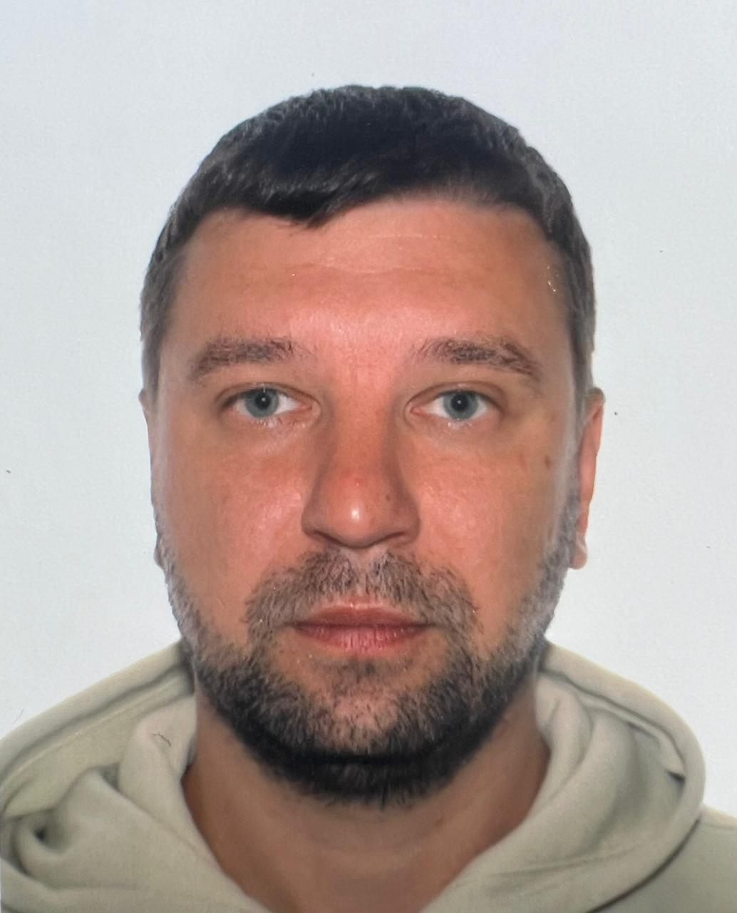

# 👋 About Me

 

   

 

Hello! 👋 My name is Artur Gritcin, and I am passionate about web development
and continuous learning. I’m currently studying at BF FrontEnd class 2025, where
I am enhancing my skills in modern front-end technologies and best practices.

## Skills and Interests

- 🌐 Web Development: HTML, CSS, JavaScript, React, Node
- 🚀 Passionate about creating responsive and user-friendly applications
- 📚 Always eager to learn new technologies and improve my coding skills
- 🤝 Enjoy working in teams and contributing to collaborative projects

## My Goals

- Master advanced front-end frameworks like React and Vue.js
- Build high-quality, scalable projects
- Contribute to open-source projects and collaborate with other developers
  worldwide

## You cam find me:

